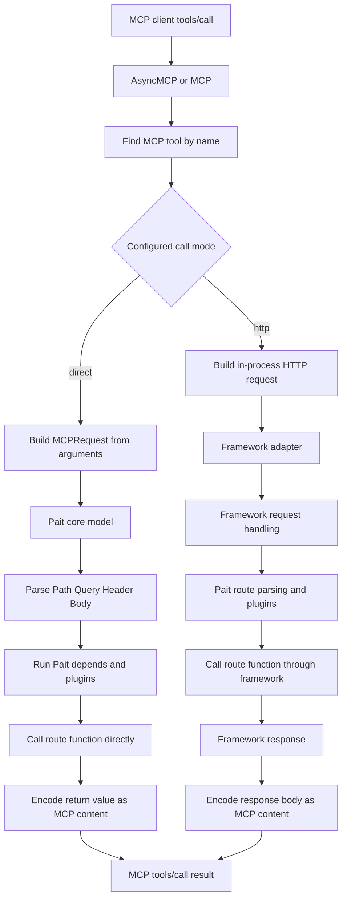
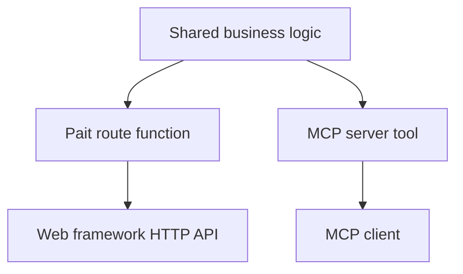

## 1.Introduction

`Pait` can expose route functions as [MCP](https://modelcontextprotocol.io/) tools. This is useful when an
application already uses `Pait` to describe HTTP parameters and wants to reuse the same route metadata for
LLM clients.

An MCP server created by `Pait` will:

- Load `Pait` route metadata from the web application.
- Convert routes marked by `MCPConfig(include=True)` into MCP tools.
- Build each tool's `inputSchema` from the route function's `Path`, `Query`, `Header`, `Json`, and other Pait fields.
- Register an HTTP `POST` endpoint, `/mcp` by default, that handles MCP JSON-RPC messages.
- Optionally expose static or dynamic MCP resources through `@mcp.resource`.

!!! note

    MCP support only exports routes that are explicitly enabled. Normal `Pait` routes will not become MCP tools unless
    `MCPConfig(include=True)` is configured.

## 2.Minimal example

Use `MCPConfig` in the route's `extra["mcp"]` data. `name` is the MCP tool name and `description` is shown to the
client. If a route should be read-only, set `read_only=True`; `Pait` will add MCP's `annotations.readOnlyHint`.

The following examples are the minimal runnable code for exposing Pait routes as MCP tools.

=== "Flask"

    ```py linenums="1" title="docs_source_code/mcp/flask_mcp_demo.py" hl_lines="7 15-25 35-43"
    --8<-- "docs_source_code/mcp/flask_mcp_demo.py"
    ```

=== "Starlette"

    ```py linenums="1" title="docs_source_code/mcp/starlette_mcp_demo.py" hl_lines="9 17-27 37-49 58-71"
    --8<-- "docs_source_code/mcp/starlette_mcp_demo.py"
    ```

=== "Sanic"

    ```py linenums="1" title="docs_source_code/mcp/sanic_mcp_demo.py" hl_lines="8 16-26 36-49 57-67"
    --8<-- "docs_source_code/mcp/sanic_mcp_demo.py"
    ```

=== "Tornado"

    ```py linenums="1" title="docs_source_code/mcp/tornado_mcp_demo.py" hl_lines="8 16-28 39-52 55-57"
    --8<-- "docs_source_code/mcp/tornado_mcp_demo.py"
    ```

=== "Django"

    ```py linenums="1" title="docs_source_code/mcp/django_mcp_demo.py" hl_lines="11 15-25 31-37"
    --8<-- "docs_source_code/mcp/django_mcp_demo.py"
    ```

After all application routes are registered, create an MCP instance. Flask uses `MCP`; asynchronous frameworks use
`AsyncMCP`. Django also uses `MCP` with a URL pattern list. The MCP endpoint path defaults to `/mcp`; these examples keep the default explicitly.

`mcp_path` defaults to `/mcp`. Set it to `None` if you want to load tools without registering the HTTP endpoint, then
call `mcp.add_mcp_route(app, "/custom-mcp")` manually.

## 3.Tool input arguments

`Pait` keeps the original HTTP parameter source in the MCP tool schema. A route such as:

```py linenums="24" title="docs_source_code/mcp/starlette_mcp_demo.py"
--8<-- "docs_source_code/mcp/starlette_mcp_demo.py:25:34"
```

Receives MCP arguments grouped by source:

```json
{
  "body": {
    "name": "so1n",
    "age": 18
  },
  "query": {
    "notify": true
  },
  "header": {
    "X-Request-Id": "req-1"
  }
}
```

The same names are used when calling a tool through JSON-RPC:

```json
{
  "jsonrpc": "2.0",
  "id": 1,
  "method": "tools/call",
  "params": {
    "name": "upsert_user",
    "arguments": {
      "body": {
        "name": "so1n",
        "age": 18
      },
      "query": {
        "notify": true
      },
      "header": {
        "X-Request-Id": "req-1"
      }
    }
  }
}
```

## 4.MCPConfig

`MCPConfig` controls how a single `Pait` route is exported.

| Parameter   | Default | Description                                                                                       |
|-------------|---------|---------------------------------------------------------------------------------------------------|
| include     | `False` | Whether this route should be exported as an MCP tool.                                             |
| name        | `""`    | MCP tool name. If empty, `Pait` uses route metadata and sanitizes it to an MCP-compatible name.    |
| description | `""`    | MCP tool description. If empty, `Pait` uses route `desc` or `summary`.                            |
| call_mode   | `""`    | Route-level call mode. Empty means using the MCP instance default. Otherwise use `direct` or `http`. |
| read_only   | `False` | Add MCP `annotations.readOnlyHint` for routes that do not mutate state.                           |

## 5.Call mode

MCP tools can be called in two modes. The mode only controls how Pait executes the already exported tool on the server
side. MCP clients do not choose the mode in `tools/call`; they only pass the tool name and arguments.

| Mode     | Description                                                                                                                        |
|----------|------------------------------------------------------------------------------------------------------------------------------------|
| direct   | Calls the `Pait` core model directly. This is the default mode. It is faster and does not require a real framework request object. |
| http     | Rebuilds an in-process HTTP request and dispatches it through the framework adapter. Use it when framework request behavior matters. |

The MCP instance defaults to `direct` mode. A route can override the default:

```py linenums="42" title="docs_source_code/mcp/starlette_mcp_demo.py"
--8<-- "docs_source_code/mcp/starlette_mcp_demo.py:42:55"
```

### 5.1.Direct mode

In `direct` mode, Pait creates an MCP request adapter from the `tools/call` arguments and sends it directly to the Pait
core model. The original route function and Pait parameter parsing still run, including `Path`, `Query`, `Header`,
`Json`, `Depends`, plugin stacks, and response encoding. However, there is no real framework request object.

Use `direct` when the route only depends on Pait-managed input data and Pait dependencies. Avoid `direct` when the route
needs framework-specific request APIs, framework middleware state, session objects, or other data that only exists after
the framework has built a real request.

### 5.2.HTTP mode

In `http` mode, Pait converts the `tools/call` arguments into an in-process HTTP request and dispatches that request
through the framework adapter. `path`, `query`, `header`, `cookie`, `body`, and `form` arguments are converted into the
corresponding HTTP request parts before the route is called.

Use `http` when the route needs framework request handling, framework response conversion, request object access, or
behavior that is only available when the framework request layer runs. This mode is closer to a normal HTTP request, but
it has more overhead than `direct` mode and depends on whether the framework integration provides an in-process
dispatcher.



!!! note

    `http` mode is available only when the framework integration exposes an in-process HTTP dispatcher. Flask, Starlette,
    Sanic, and Django provide one. Tornado's MCP integration uses `direct` mode because it does not provide an ASGI/WSGI
    in-process HTTP interface.

## 6.Resources

MCP resources can be registered with `@mcp.resource`. The decorated function may return plain text, a dictionary, a
list, a Pydantic model, or another value supported by the MCP content encoder.

```py linenums="66" title="docs_source_code/mcp/starlette_mcp_demo.py"
--8<-- "docs_source_code/mcp/starlette_mcp_demo.py:66:71"
```

Clients can list and read resources through `resources/list` and `resources/read`:

```json
{
  "jsonrpc": "2.0",
  "id": 2,
  "method": "resources/read",
  "params": {
    "uri": "config://app"
  }
}
```

## 7.Global configuration

If many routes should share the same MCP settings, use `apply_mcp_config` with `MatchRule`.

```py linenums="1" title="docs_source_code/mcp/apply_mcp_config_demo.py"
--8<-- "docs_source_code/mcp/apply_mcp_config_demo.py"
```

Pass `build_apply_func_list()` to `config.init_config(apply_func_list=build_apply_func_list())`. This keeps MCP
configuration close to the existing `Pait` config system. Per-route `extra["mcp"]` is still useful when a tool needs a
stable public name, custom description, or a route-specific `call_mode`.

## 8.Supported MCP methods

The HTTP MCP endpoint accepts JSON-RPC-style messages and currently supports:

| Method                      | Description                                      |
|-----------------------------|--------------------------------------------------|
| initialize                  | Returns protocol version, server info, and capabilities. |
| notifications/initialized   | Acknowledges the client initialized notification. |
| ping                        | Returns an empty ping result.                    |
| tools/list                  | Lists exported `Pait` routes as MCP tools.       |
| tools/call                  | Calls an exported route by MCP tool name.        |
| resources/list              | Lists registered MCP resources.                  |
| resources/read              | Reads a registered MCP resource by URI.          |

## 9.Limitations and best practice

Pait MCP provides limited compatibility between API routes and MCP tools. It is intended to help reuse Pait route
metadata, parameter parsing, and simple route execution when an existing HTTP API needs to be exposed to MCP clients.
It is not a full replacement for a dedicated MCP server implementation.

The recommended architecture is to extract shared business logic into independent functions or service classes. Then
let each protocol layer call that shared logic:

- HTTP API routes should be handled by Pait and the web framework.
- MCP tools and resources should be handled by an MCP server.

This keeps HTTP-specific behavior, such as request objects, middleware, response conversion, sessions, and framework
extensions, out of MCP tool implementation. It also keeps MCP-specific behavior, such as tool names, resource URIs,
tool annotations, and MCP error handling, out of HTTP route implementation.



Use Pait MCP when compatibility and quick exposure are more important than protocol-specific design. For new systems or
complex tools, prefer a dedicated MCP server that calls the same shared logic as the API route.
